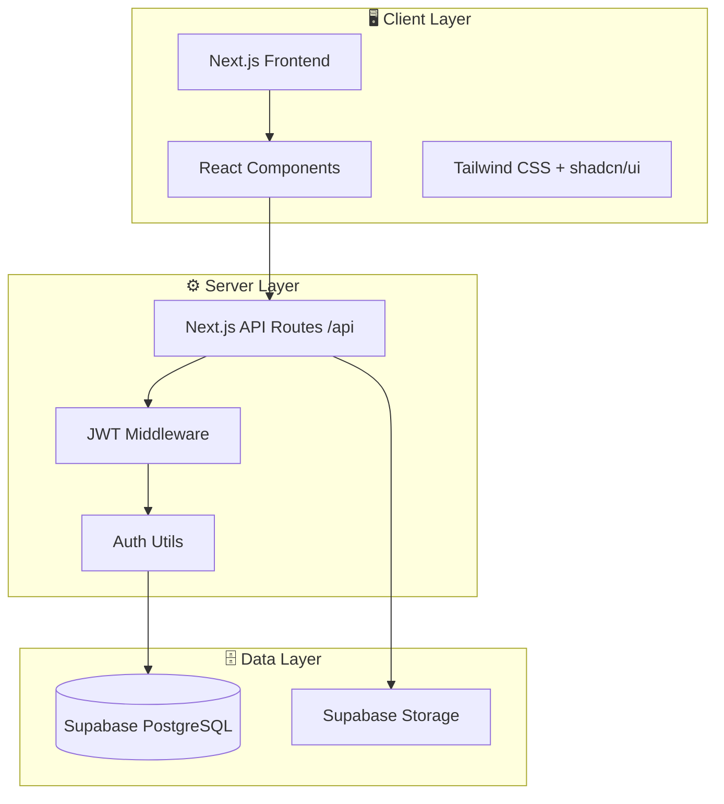
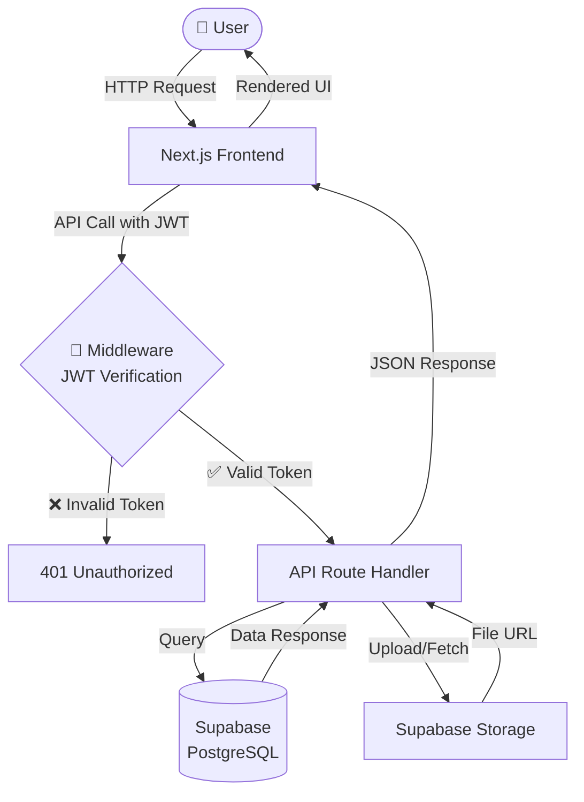
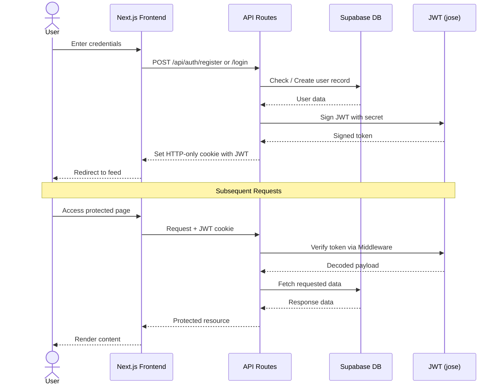

# 🚀 SocialConnect / Connexio
### Full-Stack Social Media Platform

> A lightweight social networking application with authentication, posts, likes, comments, and personalized feeds.

---

## 📋 Table of Contents

- [Overview](#-overview)
- [System Architecture](#-system-architecture)
- [Data Flow Diagram](#-data-flow-diagram)
- [Authentication Flow](#-authentication-flow)
- [Tech Stack](#-tech-stack)
- [API Design](#-api-design)
- [Project Structure](#-project-structure)
- [Setup & Installation](#-setup--installation)
- [Features](#-features)
- [Security Features](#-security-features)

---

## 🔍 Overview

**SocialConnect** is a full-stack social media application where users can:

- 🔐 Register and login using JWT authentication
- 📝 Create posts with optional images
- ❤️ Like and comment on posts
- 👤 Manage their profile
- 👥 Follow/unfollow users (optional)
- 📰 View a feed of posts

---

## 🏗️ System Architecture



---

## 🔄 Data Flow Diagram



---

## 🔐 Authentication Flow



---

## 🧰 Tech Stack

### 🎨 Frontend

| Technology | Purpose |
|------------|---------|
|  | Full-stack React framework |
|  | UI component library |
|  | Type-safe JavaScript |
|  | Utility-first styling |
| `shadcn/ui` | Accessible component primitives |

### 🧠 Backend

| Technology | Purpose |
|------------|---------|
| Next.js API Routes (`/api`) | Serverless backend endpoints |
| Middleware | JWT verification layer |
| `jose` | JWT signing & verification |

### 🗄️ Database & Storage

| Technology | Purpose |
|------------|---------|
|  | PostgreSQL database |
| Supabase Storage | Image & file storage |
| Supabase JS Client | Database SDK |

### 🔐 Security

| Technology | Purpose |
|------------|---------|
| `bcryptjs` | Password hashing |
| JWT | Stateless authentication |

### ☁️ Deployment

| Technology | Purpose |
|------------|---------|
|  | Hosting & CI/CD |
|  | Source control |

---

## 🔌 API Design

### 🔐 Authentication

| Method | Endpoint | Description |
|--------|----------|-------------|
| `POST` | `/api/auth/register` | Register a new user |
| `POST` | `/api/auth/login` | Login and receive JWT |
| `POST` | `/api/auth/logout` | Clear auth cookie |

### 👤 Users

| Method | Endpoint | Description |
|--------|----------|-------------|
| `GET` | `/api/users` | List all users |
| `GET` | `/api/users/{id}` | Get user by ID |
| `PATCH` | `/api/users/me` | Update current user profile |

### 📝 Posts

| Method | Endpoint | Description |
|--------|----------|-------------|
| `POST` | `/api/posts` | Create a new post |
| `GET` | `/api/posts` | Retrieve all posts |
| `PATCH` | `/api/posts/{id}` | Edit a post |
| `DELETE` | `/api/posts/{id}` | Delete a post |

### ❤️ Social Features

| Method | Endpoint | Description |
|--------|----------|-------------|
| `POST` | `/api/posts/{id}/like` | Like a post |
| `DELETE` | `/api/posts/{id}/like` | Unlike a post |
| `POST` | `/api/posts/{id}/comments` | Add a comment |
| `GET` | `/api/posts/{id}/comments` | Get post comments |

### 📰 Feed

| Method | Endpoint | Description |
|--------|----------|-------------|
| `GET` | `/api/feed` | Get personalized user feed |

---

## 📁 Project Structure

```
├── app/
│   ├── api/
│   │   ├── auth/
│   │   │   ├── register/
│   │   │   ├── login/
│   │   │   └── logout/
│   │   ├── users/
│   │   │   ├── [id]/
│   │   │   └── me/
│   │   ├── posts/
│   │   │   └── [id]/
│   │   │       ├── like/
│   │   │       └── comments/
│   │   └── feed/
│   └── page.tsx
│
├── lib/
│   ├── supabase.ts
│   ├── jwt.ts
│   └── auth-utils.ts
│
├── types/
│   └── index.ts
│
└── middleware.ts
```

---

## ⚙️ Setup & Installation

### 1. Clone the repository

```bash
git clone <your-repo-url>
cd project
```

### 2. Install dependencies

```bash
npm install
```

### 3. Configure environment variables

Create a `.env.local` file in the root directory:

```env
NEXT_PUBLIC_SUPABASE_URL=your_supabase_project_url
NEXT_PUBLIC_SUPABASE_ANON_KEY=your_supabase_anon_key
SUPABASE_SERVICE_ROLE_KEY=your_supabase_service_role_key
JWT_SECRET=your_jwt_secret_key
```

### 4. Run the development server

```bash
npm run dev
```

Open [http://localhost:3000](http://localhost:3000) in your browser.

---

## ✨ Features

- [x] JWT Authentication (register, login, logout)
- [x] Create / Edit / Delete Posts
- [x] Image Upload via Supabase Storage
- [x] Like & Comment System
- [x] User Profiles
- [x] Personalized Feed System
- [ ] Follow / Unfollow Users *(optional)*

---

## 🔐 Security Features

- 🔒 **Password hashing** using `bcryptjs`
- 🪪 **JWT-based authentication** via `jose`
- 🛡️ **Protected API routes** with middleware
- ✅ **Input validation** on all endpoints
- 🍪 **HTTP-only cookies** for token storage

---

## 🏁 Conclusion

This project demonstrates a production-level full-stack application using:

| Layer | Technology |
|-------|------------|
| Frontend + Backend | Next.js (App Router + API Routes) |
| Database + Storage | Supabase (PostgreSQL + Supabase Storage) |
| Authentication | JWT with `jose` + `bcryptjs` |
| Deployment | Vercel + GitHub |

> Built with clean API architecture, type safety, and security best practices throughout.
